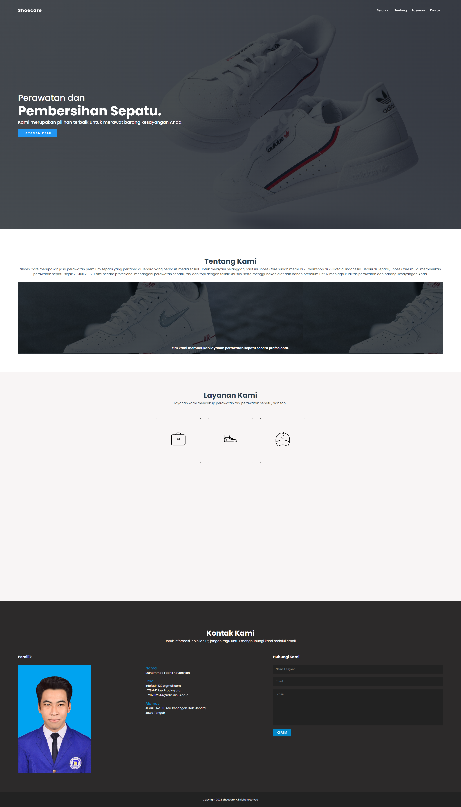

# Landing Page
Submission: Tugas Akhir Membuat Website pada kelas Belajar Dasar Pemrograman Web

#### Kriteria
Berikut kriteria-kriteria wajib submission yang harus Anda penuhi.
- Terdapat elemen <header>, <footer>, <main>, <article>, dan <aside> di berkas HTML.
- Masing-masing elemen wajib berisi konten yang peruntukkannya sesuai dengan elemen tersebut (menerapkan konsep semantic HTML dalam menyusun struktur website).
    Contohnya:
    - Tidak terdapat duplikasi elemen <main>.
    - Elemen <main> harus berada diantara <header> dan <footer>.
    - Harus terdapat elemen <header> sebelum <main> dan <footer> sesudah <main>.
    - Jika terdapat elemen <header> atau <footer> di dalam elemen <article> atau <aside>, maka hal tersebut diperbolehkan.
- Wajib menampilkan menampilkan foto di elemen <aside>. Anda boleh menampilkan foto diri Anda sekaligus menampilkan biodata lainnya atau Anda juga bisa menampilkan foto yang relevan dengan konten yang Anda tulis.
- Menyusun layout menggunakan flexbox, bukan float.
- Tema yang ditampilkan bebas, kecuali tema Bandung.
- Semakin detail dan lengkap website Anda maka nilai submission akan makin tinggi.

#### Saran
- Menerapkan tampilan aplikasi yang menarik.
    - Memiliki pemilihan warna yang pas dengan tema aplikasi. Dalam memilih warna, Anda dapat memanfaatkan tools pemilihan warna seperti colorhunt.co.
    - Tata letak elemen yang pas. 
        Contoh:
        - Tidak ada konten yang bertumpuk.
        - Penggunaan font yang pas dengan tema.
        - Penerapan padding dan margin yang pas.
- Menerapkan layout yang responsif.
    - Menggunakan media query untuk menyesuaikan layout pada berbagai ukuran layar device.
    - Pastikan untuk tidak terdapat konten yang menumpuk maupun keluar dari kontainer ketika dicoba pada dekstop, tablet, dan juga mobile.
- Terdapat penerapan JavaScript dalam memanipulasi DOM. Berikut contoh-contoh penerapan JavaScript dan silakan pilih salah satu.
    - Membuat dropdown.
    - Memanfaatkan logika seperti looping dalam menampilkan elemen dan konten.
    - Membuat slider.
    - dan lainnya yang mendukung tampilan website agar lebih hidup.

## Rating Submission
⭐⭐⭐⭐⭐

## Screenshot

## Tech Stack

 